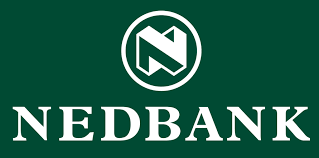

---

layout: col-sidebar
title: OWASP Johannesburg
tags: Johannesburg
level: 0

region: Africa

auto-migrated: 1

---

OWASP Johannesburg
-------------
Welcome to the Johannesburg chapter homepage. The chapter board is <a href="mailto:tmatima@owasp.org">TK Matima</a> and <a href="mailto:sakhi.louw@owasp.org">Sakhi Louw</a>. Follow chapter news on | [Twitter](https://twitter.com/OWASP_JHB) | [Meetup.com](https://www.meetup.com/OWASP-Johannesburg-Chapter/)


Chapter Sponsors
----------------
If you would like to be a OWASP JHB Chapter corporate sponsor, please get in touch with us.


Meeting Sponsors
----------------
The following is the list of organisations who have generously provided us with space for OWASP Johannesburg chapter meetings:


<table cellpadding="10" cellspacing="0" border="0">
<tr>
<td>


</table>

Speaking at OWASP Johannesburg Chapter Events
---------------------------------------

#### Call For Speakers

Call For Speakers is open - if you would like to present a talk on Application Security at future OWASP Johannesburg Chapter events - please review and agree with the [OWASP Speaker Agreement](Speaker_Agreement "wikilink") and send the proposed talk title, abstract and speaker bio to the Chapter Leaders via e-mail.

Next Meeting/Event(s)
---------------------
OWASP JHB Chapter meetings are posted on our MeetUp Page:

Please visit [Meetup.com](https://www.meetup.com/OWASP-Johannesburg-Chapter/)


<!-- Standard Chapter Page Template
This is an example of a Project or Chapter page.
Please change these items to indicate the actual information you wish to present. In addition to this information, the 'front-matter' above the text should be modified to reflect your actual information.  An explanation of each of the front-matter items is below:

{front matter for this file}

```
- layout: This is the layout used by project and chapter pages.  You should leave this value as col-sidebar
- title: This is the title of your project or chapter page, usually the name.  For example, OWASP Zed Attack Proxy or OWASP Baltimore
- tags: This is a space-delimited list of tags you associate with your project or chapter.  If you are using tabs, at least one of these tags should be unique in order to be used in the tabs files (an example tab is included in this repo) 
- region: This is the region you are in according to our data
```

{copy for this file (index.md)}
Replace the text above the commented area with your information in the format below:
```
## Welcome
Include some information here about your chapter

## Participation
The Open Web Application Security Project (OWASP) is a nonprofit foundation that works to improve the security of software. All of our projects ,tools, documents, forums, and chapters are free and open to anyone interested in improving application security. 

Chapters are led by local leaders in accordance with the [Chapter Leader Handbook](/www-policy/rules-of-procedure/chapter-handbook). Financial contributions should only be made online using the authorized online donation button. To be a SPEAKER at ANY OWASP Chapter in the world simply review the [speaker agreement](/www-policy/speaker-agreement) and then contact the local chapter leader with details of what OWASP Project, independent research, or related software security topic you would like to present.

Everyone is welcome and encouraged to participate in our [Projects](/projects), [Local Chapters](/chapters), [Events](/events), [Online Groups](https://groups.google.com/a/owasp.com/){:target='_blank'}, and [Community Slack Channel](https://owasp.slack.com/){:target='_blank'}. We especially encourage diversity in all our initiatives. OWASP is a fantastic place to learn about application security, to network, and even to build your reputation as an expert. We also encourage you to be [become a member](/membership) or consider a [donation](/donate) to support our ongoing work.

## Local News
- Meeting Location
- Everyone is welcome to join us at our chapter meetings.

```
{info.md}

[Meetup.com](https://www.meetup.com/OWASP-Johannesburg-Chapter/)

{leaders.md}

 <a href="mailto:tmatima@owasp.org">TK Matima</a> and <a href="mailto:sakhi.louw@owasp.org">Sakhi Louw</a>

-->
